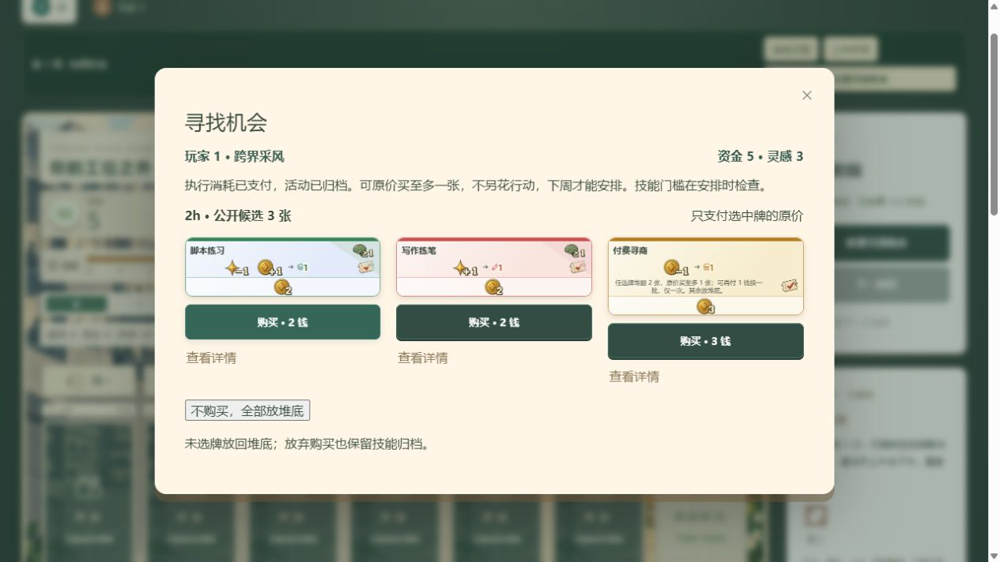

# v0.12 · 四色寻找机会活动与试玩

本版目标：让玩家通过安排活动主动寻找机会，同时保留其他玩家正在围绕构筑的市场明牌。取消整备中的指定明牌刷新；整备仍拿 1 资金，正常购买仍立即补充明牌。市场展示量保持 2h/4h/8h 各 5/4/3 张。

## 新增卡牌

四张都属于一次性成长活动，购入价 3、日程压力 0；成功执行后离开日程并归档对应颜色，同名不重复增加技能。每种普通牌的实体张数与玩家人数相同，仍混在三个原有牌堆，不另设机会牌堆。

| 流派 | 卡牌 | 时间 | 执行条件/代价 | 寻找效果 |
| --- | --- | --- | --- | --- |
| 红·创作 | A14 跨界采风 | 2h | 支付 1 灵感 | 任选一堆，翻 3 张，原价买至多 1 张，余牌放堆底 |
| 黄·商业 | C14 付费寻商 | 2h | 支付 1 资金 | 任选一堆，翻 2 张，原价买至多 1 张；可放弃首批，再付 1 资金换 2 张，仅一次 |
| 绿·开发 | B14 机会整理 | 4h | 无执行消耗 | 任选一堆，翻 3 张，原价买至多 1 张；剩余每张可放堆顶或堆底，自定顺序 |
| 灰·职场 | W14 内部交流 | 2h | 仅工作白天，理智 ≤3，履职免查岗 | 任选一堆，翻 2 张，原价买至多 1 张，余牌放堆底 |

开发牌改名为“机会整理”，避免与原有常驻牌 B05“信息整理”重名。当前总计 56 种市场牌、2 种个人项目；每色 14 种市场牌。

## 结算与实体操作

1. 按日程先后、同一时段按本周首位玩家开始的轮流顺序执行。活动被查停、团建阻断或付不起执行费用时，保留到下一周，不归档、不翻牌。
2. 成功时先支付执行消耗并归档，再暂停其他结算，选择 2h、4h、8h 中的一堆，将候选公开放在该堆旁。
3. 可按印刷原价买至多一张，也可放弃。购买不再花一个日程行动；新牌放手牌，下周才可安排。高级牌允许先买，技能要求仍在安排时检查。
4. 商业重选须先放弃首批，两批不能混选。先把首批放一旁、翻出第二批，再把首批放堆底，避免短牌堆立刻翻回同一张实体牌；同名的另一张实体牌仍可能出现。第二批不能再次重选。
5. 开发活动购买或跳过后，再整理剩余牌。网页两列均按未来抽取顺序由上至下排列：堆顶列先被抽到，堆底列在原牌堆之后被抽到。排列结束后才继续下一项活动。
6. 没有购买也保留本次归档；空牌堆照常结束、没有补偿。原牌堆用尽时按现有规则洗入弃牌堆，不足数量就翻实际可用数量。
7. 研讨会、猎头等原有寻访保持原效果：周末从未亮出的指定高级牌中免费取得一张，空选补偿 1 资金。它们与本次付费找牌是两个不同效果。

找牌付款发生在对应活动执行时，不能提前动用后续活动收入或周末工资。候选公开不等于变成公共市场：这次购买权属于执行者。网页存档保留候选、剩余结算队列、已付费用和整理顺序，刷新不会重抽。

## 验证结果

- 76 项规则测试通过，其中新增 16 项覆盖四种活动、付费与重选、候选及牌堆顺序、技能归档、暂停/续算、存档恢复、查岗与资源不足、预览不读取暗牌、机器人使用已归档同名的找牌活动。
- 静态构建通过。
- 浏览器实际操作两周，2 人同机、种子 36、默认数值。用于验证新流程，双方其余行动主要整备，**不是完整的人类策略对局**。

第一周先购入并安排“机会整理”和“跨界采风”。开发活动将“脚本练习”“写作练笔”放堆顶，将“补齐项目文档”放堆底；整理中刷新，顺序保持。随后创作活动支付 1 灵感，翻到前两张指定卡及“付费寻商”。原价 3 钱购入“付费寻商”，当周不能安排；工资后资金 4，A/B 各归档 1。

第二周安排上周购入的“付费寻商”。执行扣 1 钱后资金 9，另付 1 钱重选后为 8；刷新后仍是第二批，不能继续重选。花 3 钱买入“健身私教”，工资后资金 7，C 归档 1。公共市场的现有牌没有被这些操作替换。



## 自动对局与尚未解决的问题

覆盖 2/3/4 人 × 3 个种子，均用 A02 起始成长牌，其他参数默认。35 周是测试保护上限，不是游戏规则。原机器人把同名已归档活动都视为无用，首轮 9 局全部停滞；修正为仍会购买、执行具有找牌价值的同名活动后，得到以下结果。没有为提高胜率修改卡牌数值或胜负门槛。

| 人数 | 种子 | 结果 | 找牌次数 / 买入数 | 市场最长连续不变周数 |
| --- | --- | --- | --- | --- |
| 2 | 7 | 第 14 周结束 | 4 / 3 | 1 |
| 2 | 42 | 35 周未结束 | 5 / 0 | 21 |
| 2 | 20261009 | 第 19 周结束 | 3 / 1 | 4 |
| 3 | 7 | 35 周未结束 | 5 / 4 | 20 |
| 3 | 42 | 35 周未结束 | 6 / 2 | 23 |
| 3 | 20261009 | 35 周未结束 | 7 / 3 | 20 |
| 4 | 7 | 35 周未结束 | 5 / 3 | 27 |
| 4 | 42 | 35 周未结束 | 7 / 4 | 24 |
| 4 | 20261009 | 35 周未结束 | 8 / 6 | 26 |

共成功执行 50 次找牌，购买 26 张；自动局没有实际使用商业重选，重选由规则测试与网页试玩覆盖。原始数据见 [模拟结果](simulation-opportunity-v0.12.json)，首轮机器人结果见 [策略修正前记录](simulation-opportunity-v0.12-baseline.json)。

判断：开发整理接续创作找牌已经形成可操作的组合，也消除了主动刷掉别人目标明牌的行为。但**仅把找牌放入一次性活动，尚未证明能持续解决市场停滞**。这批停滞局最后一次找牌发生在第 5–10 周，之后市场连续 20–27 周未变化，找牌活动本身也可能无法再取得。

同时，一部分玩家收入到 10 而理智不足 6；还有玩家理智够、收入不够。机器人对腾出压力、选择搜索牌堆和组合支持牌仍较粗糙，所以不能把所有未结束归因于市场。卡池新增也改变了洗牌，同种子与旧版不是严格配对实验，不能据此断言新机制更差。

下一次真人测试优先记录：找牌活动是否容易取得；一次投入是否值得占用购买与安排两个行动；是否能主动找到缺失的收入或支持组件；找牌结束后是否又只能等待。若确认持续渠道不足，下一版优先测试一种可重复使用、仍需付费与占时间的找牌活动。本版未擅自追加该规则。

## 复现

```text
npm test
npm run build
npm run simulate -- --output docs/simulation-opportunity-v0.12.json
```

最后一条因 7 局未结束返回状态码 1，是对节奏问题的提示，不是结算异常。v0.12 使用独立存档；既有 v0.11 存档保留。旧 A4 图纸仍为 v0.6，本次没有重制。
