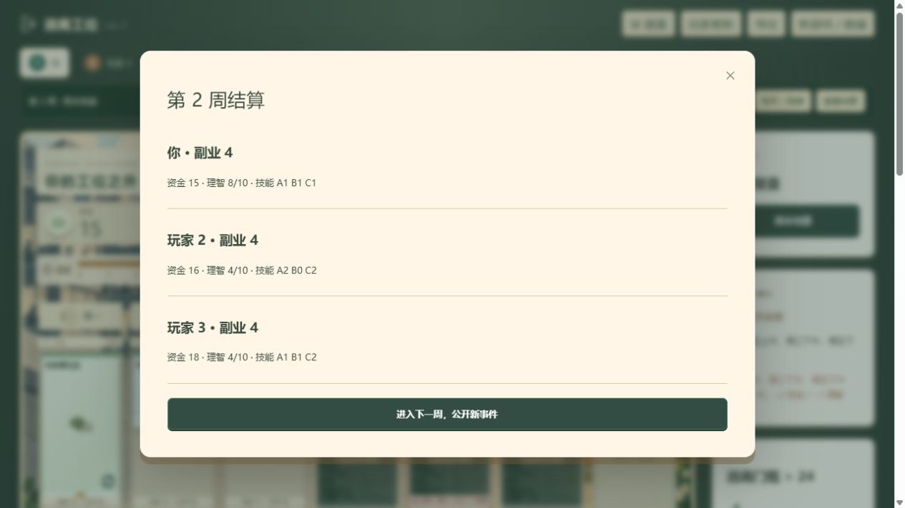

# 当前 Demo 试玩审阅 · 2026-10-09

结论：核心流程可以完成对局，但现有卡池尚未充分支撑“规划职业路线、逐步释放时间、形成引擎”的目标。优先调整基础牌与高级牌的分工，以及时间、理智的实际约束，再扩充卡池。本轮未修改玩法、卡牌数值或用户存档。

## 测试方法与边界

- 现有 41 项规则测试全部通过。
- 基线：2、3、4 人各 100 局，种子 1–100，默认初始设置，所有玩家使用现有机器人，共 300 局。
- 对照：另跑 100 局三人游戏；玩家 0 仅买基础多次活动，允许重复购买，不买技能、研讨、猎头、高级牌，其余两人使用原机器人。双方遵守相同行动与公开信息限制。
- 浏览器：使用与当前 Demo 相同的引擎与界面，另设存档键，人工选择动作完成两周；检查购买、安排、跨周保留、逐步/一键结算、技能留存、周末抽选、事件刷新。控制台无警告或错误。
- 自动策略均为启发式，不能据此证明最优策略、真人胜率或真人时长。未进行多人实体计时；以下结算负担用待处理卡牌数量衡量。
- 脚本的 35 周上限只用于防止测试挂起，不是游戏规则；全部样本均在上限前正常结束。

## 对局长度与结算负担

| 人数 | 对局周数中位数 | 周数范围 | 末周全桌待结算卡牌中位数 | 末周待结算卡牌 P90 |
|---|---:|---:|---:|---:|
| 2 | 5 | 4–9 | 17 | 21 |
| 3 | 6 | 4–10 | 28 | 35 |
| 4 | 7 | 5–12 | 42 | 49 |

待结算卡牌包含当周可能失败或被事件阻止的活动，这些在实体桌面上也需要检查；不包含工资、生活费、永久能力及周末选牌的额外操作。网页按共同时间点推进会把多名玩家的牌合并成一次点击，不能把点击次数当作实体操作次数。

七次行动再结算，已经缓解了旧版“买两轮就结算”的频繁打断。但三人末周仍需处理约 28 张牌，四人约 42 张。若平均每张检查及操作耗时 3–5 秒，仅卡牌部分分别约 84–140 秒、126–210 秒；这是用于说明负担的假设估算，不是实测。现阶段不能宣布实体结算节奏已经解决。

## 主要发现

### 1. 技能树可以被基础收入堆叠绕开

基础路线玩家在 100 局里逃离 70 次，成功样本的逃离周数中位数为第 5 周，范围 3–8 周。作为参考，全机器人基线中玩家 0 也恰为 70 次逃离、中位数第 5 周。因此证据支持“基础路线足以获胜”，不支持“基础路线显著强于技能路线”。

种子 42 的基础路线在第 6 周以副业收入 29 逃离，全程零技能。最终持有初始三张牌、街角散步、三张周末陪练、额外一张零散接单、额外两张专辑及一本闲书。实际收入序列为 4、11、15、15、22、29。

问题不是必须禁止基础路线获胜，而是它用重复牌就能完成主要目标，技能投入尚未呈现足够鲜明的收益。原机器人主动回避同名多次活动，单独使用它测试会漏掉这条路线。

### 2. 高级牌的发挥窗口偏短

三人基线中，成功执行过高级牌的玩家首次执行周数中位数为第 5 周；对局中位数第 6 周结束。按每位玩家所在对局计算，首次高级执行距结束的周数差中位数为 1。

高级牌容易成为临近终局的一次收入跃升，长期折扣、两周完成的项目和永久能力则更难充分展示价值。三人样本只有 90/300 名玩家在结束前完成过永久能力牌；只有 28/300 名玩家取得永久双休。这些比例受机器人偏好影响，但与短发挥窗口一致。

### 3. 时间位置充裕，公开查岗的压力主要是搬家行动

300 局共出现 6 次抓包：二人 1 次、三人 2 次、四人 3 次。机器人会优先移动受检查的牌，因此低抓包数本身不意味着查岗完全无作用。

然而每位玩家有 12 个工作白天槽、2 个周日白天槽和 7 个夜晚槽，而每周查岗只覆盖少数白天。早中期往往能找到安全空位。三人基线的移动加撤回约占全部行动的 6.3%，大多数操作仍是购买和首次安排（约 79.8%）。

这会同时削弱大时长活动的机会成本、熬夜的吸引力以及争取双休的价值。仅调整抓包扣钱数值，无法让未被检查的空位产生代价。后续应保留已确定的公开事件规则，先明确白天、夜晚、周末各自应该提供什么不同利益。

### 4. 理智主要约束启动，随后容易封顶

三人基线各周结算后理智均值：第 1 周 3.28，第 2 周 4.39，第 3 周 6.08，第 4 周 7.96，第 5 周 9.14，第 6 周 9.75。后期数据仅含仍在进行的对局，不是完全相同的队列。

结束时 251/300 名玩家理智为 10，约 83.7%。原因与规则结构一致：安排压力只下降一次，持续恢复牌却每周生效；回避查岗后，持续下降来源很少。0–10 指标本身没有越界错误，但高级牌的理智门槛会逐渐失去区分度。

后续应统一设计“持续恢复、一次性恢复、可逆安排压力”的关系；不要只压低开局理智，也不要未经讨论恢复已经取消的每周工作扣理智。

### 5. 已存在明显的重复与劣势牌

| 卡牌 | 购买 | 占时 | 每次执行成本 | 每次收益 |
|---|---:|---:|---|---|
| 街角散步 | 3 | 1h | 无 | 理智 +1 |
| 淘宝购物 | 3 | 1h | 资金 −1 | 理智 +1 |
| 宅家慢生活 | 7 | 4h | 无 | 理智 +1 |

按目前效果，购物相比散步没有补偿优势；购买宅家慢生活也比散步更贵、更占时，夜晚与抓包代价还更高。宅家慢生活作为免费起始牌可以使用，但这不能解释市场版本的购买价值。

这是卡池应重构的直接证据。每张牌需要独特的功能或适用情境，不能仅靠题材名字提供差异。4h 牌尤其需要对得起时长的收益或特殊能力。

## 两周浏览器试玩记录

使用默认种子 20261009，玩家 0 手动选择，两名机器人正常行动。

第一周普通事件：周一安排宅家慢生活、周二安排专辑、周三安排零散接单，周四购买修好旧物、周五安排，周六购买主理人聚会、周日安排。周结副业 4、资金 16、理智 3、技能 B1/C1；研讨选牌取得跨界工作坊。

第二周公开查岗周三下午及周五上午、下午，原有三张活动均不受影响。购买并在周二夜晚安排街角散步；一次刷新寻找所缺的 A 技能未命中；随后买温泉小憩并放在周五夜晚，最后两行动买并安排速写练习。周结副业仍为 4，资金 15、理智 8、技能 A1/B1/C1，具备下周启动跨界工作坊的条件。

操作感受：买牌和安排分开使行动成本清楚；日程跨周保留、一次性卡移入技能区也直观。第一周 7 次行动中有 3 次用于安放起始牌，剩下只能完成两组买入/安排。第二周则明显受市场是否出现 A 技能影响，安全位置的选择相对轻松。

界面仍可减少摩擦：高级牌只显示“缺技能”，应直接显示具体差额；结算抽选时同时展开机器人的大量不可点击候选牌，会增加阅读负担。当前预测只给收入，不能替代实体测试。上述问题本轮仅记录，未修改。

## 建议的下一步顺序

1. 先明确基础牌与高级牌的经济分工：基础牌负责启动、过渡或特定搭配；高级牌应能改变引擎运作方式，并获得足够的执行窗口。保留基础路线是否可胜的选择，不急于加硬性逃离门槛。
2. 再定义时间和理智的预算。决定每周希望玩家处理多少张牌、多少次资源变化，以及 1h/2h/4h 的机会成本；明确安全周末为什么值得争取。
3. 据此建立少量完整路线样本，消除明显劣势牌后重测。不要先扩充到大卡池再整体调整。
4. 最后做真人实体计时，记录决策、查阅、资源操作、整理和周末选牌。特别测试研讨/猎头从混合 4h 牌堆中寻找未亮出高级牌的实体操作成本，网页自动检索会掩盖这部分时间。

建议下一轮的验证目标（尚未作为规则实施）：首个关键能力在第 2–3 周可用，至少有两周值得继续组合和运转；基础路线与技能路线都能解释自己的机会成本；三人结算时尽量将需要单独处理的活动控制在全桌 20–25 张，再以实体计时决定是否继续压缩。

## 可复现文件

- `node scripts/audit-pacing.mjs` → `docs/pacing-audit-2026-10-09.json`
- `node scripts/audit-basic-route.mjs` → `docs/basic-route-audit-2026-10-09.json`
- `npm test` → 现有规则检查

报告中的自动数据对应本轮工作区版本；后续修改卡池或规则后应重新生成，不能继续把本报告作为新版本验证结果。
