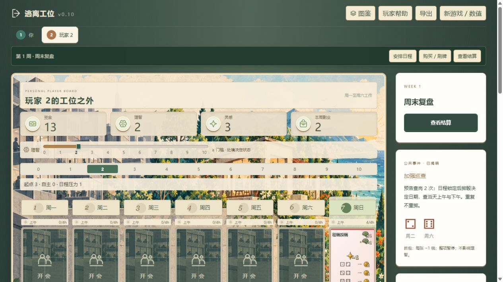

# v0.10 网页规则检查 · 2026-10-09

本次已把四色卡池、2 钱周薪、10 副业逃离、隐藏查岗和活动骰接入网页。最终采用玩家确认的抓包规则：**每张被抓活动本周暂停并罚 1 钱，2/4/8h 相同，不改变理智，没有问责系统；同张 8h 活动仅罚一次。**

## 规则与构建

`npm test`：45/45 通过。覆盖购买与安排分开、逐日锁定、市场补牌、8h 跨槽、团建、理智上下门槛、夜晚压力、技能归档、双休推进、保护项目、本金回收、增强顺序、逃离与终局。

骰子专项覆盖：只在日程锁定后掷查岗骰，全员共用结果，重复日期不重掷；暂停牌不支付执行消耗、不掷收益骰；2/4/8h 一律罚 1 钱、理智不变；活动骰三张牌的全部六面；工资奖金不计逃离；刷新保留骰面；逐步与一键结算一致；预估收益不读取或推进真实骰子流。

`npm run build`、`node scripts/check-cardpool-v10.mjs`、`node scripts/check-dice-v10.mjs` 均通过。后两项只验证预设组合与概率，不证明市场获取速度或平衡。

## 浏览器实测

本地双人轮流模式、种子 7，实际点击完成买牌、安排与一周结算：

- 购买征稿投稿后市场立即补牌；安排另耗一次行动，放在周日上午。
- 日程阶段只显示“加强巡查，2 次”，没有实际日期。
- 第 14 次行动后进入结算；掷出 2、6，公开查周二与周六。
- 此时刷新页面，仍为 2、6；一键结算后征稿投稿掷出 4，耗 1 灵感并获得 2 副业收入。该玩家理智仍是放置后的 2，没有额外扣减。
- 控制台未捕获错误。抓包固定罚款的实际命中与重复命中由上述引擎测试覆盖；本次浏览器这周没有活动被抓。

## 自动对局：未通过多人节奏验证

使用四种起始成长牌、2/3/4 人、种子 7/42/20261009，共 36 局。数据见 [simulation-v0.10.json](simulation-v0.10.json)。35 周只是测试保护上限，规则没有周数上限。

| 人数 | 35 周内结束 | 已结束局周数 |
|---|---:|---|
| 2 人 | 11/12 | 8–14 |
| 3 人 | 1/12 | 11 |
| 4 人 | 1/12 | 15 |

合计 13/36 局结束；其余 23 局触发测试上限，所以矩阵命令返回非零退出码。已检查资源不为负且为有限数，没有据此证明全部行为最优或所有规则均合法。

自动玩家先前会撤掉供应牌为高级牌腾位置，却又优先装回供应牌，已调整高级牌安装优先级及过量供应过滤。仍不擅长长期转型、组合排序与替换低效工作。不能把这些停滞全部归因于卡池，也不能忽略它们：下一步需要真人三人局或更强策略对照，检验中后期是否容易卡市场、卡理智或卡技能。没有为让脚本结束而降低逃离门槛、增加理智恢复或改变罚款。

本次没有测出可靠的真人时长，也没有证明各流派胜率接近。旧 A4 图纸仍是 v0.6，未更新。
