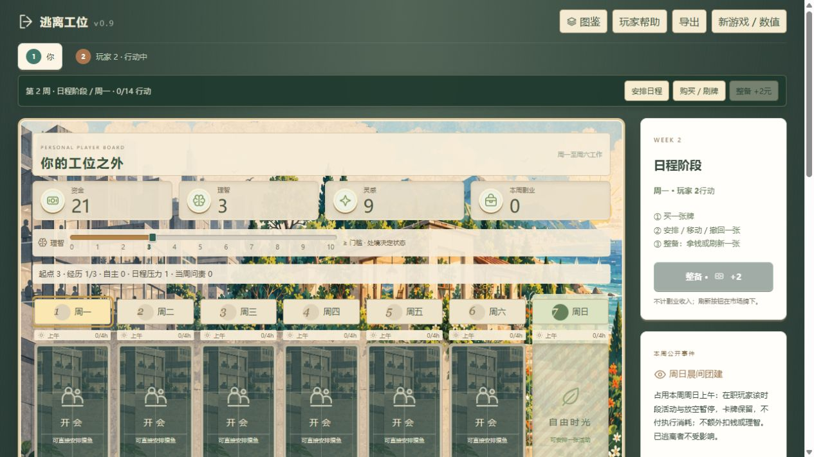

# v0.9 测试记录（历史版本）

> 下列 536 场自动对局、截图及其结论均来自删除“成长改善理智”规则之前，不能代表当前版本。当前规则已移除该加成；保留原始记录供对照，未改写旧测试结果。

2026-10-09。测试的是去掉所有理智恢复收益后的版本。设计与参数见 [数值框架](economy-v0.9.md)。

## 删除成长理智加成后的回归（2026-10-09）

- 已删除技能区不同卡名带来的理智加成；任意数量、方向及重复技能均不提高指标。A/B/C 解锁规则保留。
- 当前存档加载时重算理智，移除旧加成；保留日程、技能及其他游戏进度。
- 本次运行 npm test：46 项中 43 项通过，3 项失败。规则、成长结算、预览、理智边界、双休、多周进度与技能解锁检查通过。
- 失败的是种子 42 的 2/3/4 人自动完整对局：均在 35 周测试上限内未达到终局。此前的“全部正常结束”结论失效。35 周仅为测试保护，不是新游戏规则。
- 保留这三项失败测试以暴露当前节奏问题，没有提高起始理智、降低卡牌门槛或添加补偿规则。两个机器人压力专项用例显式使用起始理智 6 的测试场景，隔离验证搬牌/替换行为，不代表默认开局体验。

以下为删除前的历史记录。

## 规则检查

`npm test` 共 46 项：日程与行动、2/4/8h 容量、跨全天结算、查岗、技能、寻访、多周进度、逃离、卡牌守恒、预览不修改状态，以及理智状态重算。

理智专项覆盖：稳定日程跨五周不漂移；0/10 边界不能套取撤回收益；问责归零不返还罚款；技能只计不同卡名且最多改善三点；临时双休不改善长期状态；永久双休与逃离不叠加；生活/成长现金不偷算副业；全部卡牌禁止理智收益、成本与核心回血。

## 300 场常规自动对局

`node scripts/audit-v9.mjs`：2/3/4 人各 100 个种子，默认起始牌。35 周仅为测试超时保护，不是游戏终局条件。每次行动和周结验证理智与推导状态一致。

| 人数 | 正常结束 | 周数中位数 | 90% 分位 | 最长 | 首次高级安排中位数 | 末周全桌日程牌中位数 |
|---|---:|---:|---:|---:|---:|---:|
| 2 | 100/100 | 6 | 8 | 14 | 4 | 14 |
| 3 | 100/100 | 7 | 9 | 11 | 4 | 21 |
| 4 | 100/100 | 9 | 11 | 15 | 4 | 28 |

初版自动策略曾出现长期满压、无法安装高级牌的停滞；修正为使用正常行动搬走满夜牌、撤下低收入基础牌后再装高级牌。没有给自动玩家额外行动或资源。相应回归用例包含分两次行动完成替换。因为策略也改变了，不能把 v0.8→v0.9 的周数差异全部归因于数值更好。

终局理智中位数为 7，但包含已经逃离后改善的自主状态，不能拿这个数证明在职期间压力适当。四人局末周仍约 28 张牌要结算，真人结算耗时尚未测量。

数据：[常规对局](pacing-audit-v0.9.json)。

## 起始生活牌与基础路线

- 四种起始生活牌 × 三种人数 × 三个种子：36/36 正常结束，3–11 周。运行 `npm run simulate -- --matrix --output docs/simulation-v0.9.json`。
- 只买基础循环、不积累技能、不争取双休：100 场都结束，该策略 0 场逃离。这是起始理智限制最多两张基础副业导致的结构上限，不能包装成正常胜率结果。
- 放宽为允许一种成长与永久双休，仍禁高级牌和寻访：100 场都结束，该策略 4 场逃离，逃离在第 5–6 周。说明基础扩张在机制上可行，但目前的启发式策略明显落后。脚本并非最优打法，尚未对各路线的最优组合做穷举。

运行 `node scripts/audit-basic-v9.mjs` 与 `node scripts/audit-basic-v9.mjs --growth`。数据见 [基础路线](basic-route-audit-v0.9.json)、[允许少量成长](basic-growth-audit-v0.9.json)、[起始矩阵](simulation-v0.9.json)。以上合计 536 场，不等于 536 场真人体验。

## 浏览器手动操作验证

在独立测试存档中通过界面完成两人同机首周：

1. 零散接单安排到周日下午，指标 3→2；花行动撤回后回到 3。
2. 安排宅家慢生活，购买修好旧物，市场立即补回 12 张。
3. 修好旧物安排到周五夜晚，重新安排接单和听专辑，14 次行动后进入结算。
4. 一键结算得到资金 21、灵感 9、理智 3、技术技能 1、副业 2；生活牌离场，无理智收益。指标来源为起点 3＋经历 1−日程压力 1。
5. 下一周公开团建事件，常驻日程保留，理智仍为 3；玩家帮助与新版一致，浏览器无警告或错误日志。

## 判断与待验证问题

新版消除了靠购买恢复牌反复补血的循环，成长与高级副业的单位压力效率开始承担推进作用。流程可跑通，但还不能说路线已经平衡。

- 公开查岗很容易绕开。300 场的 900 名玩家共仅 50 次被抓；目前更像每周搬牌成本，冒险感仍弱。
- 前三种经历既帮助技能解锁又改善理智，可能变成固定开局。需要真人测试不同购买顺序是否有真正的机会成本。
- 少量成长的基础扩张策略落后，生活补给与常驻灵感之间也尚未做充分的对抗策略测试。
- 资金中后期积累明显，四人终局资金均值约 103，可能降低价格取舍感。不能因为游戏能结束就忽略。
- 四人最长 15 周；七行动制是否适合 60–90 分钟，必须记录真人思考、搬牌和结算耗时。自动程序耗时不是桌游时长。

下一次真人测试优先记录：第 1–3 周是否只能做同一种开局；第一次高级副业替换是否值得；理智低时是否仍有有效选择；结算实际分钟数。旧 A4 图纸未同步本版。
